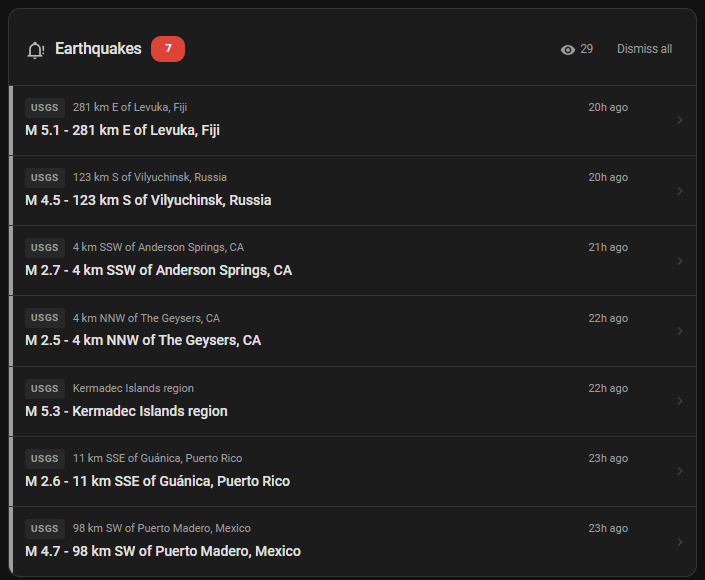
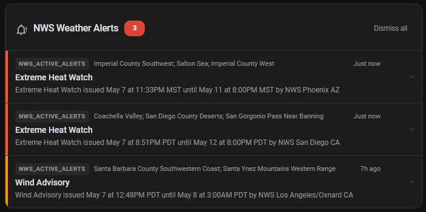

# HA Alert Card

A Home Assistant Lovelace card that displays alerts from **any entity** with structured alert data in attributes. Uses [CAP (Common Alerting Protocol)](https://docs.oasis-open.org/emergency/cap/v1.2/CAP-v1.2.html) field names as defaults — entities that already follow CAP work with zero field mapping.

## Features

- **Universal** — works with any entity that stores alerts as a list in an attribute
- **CAP defaults** — zero-config for CAP-compliant entities (event, description, severity, etc.)
- **Custom mapping** — override field names for non-CAP entities
- **Multiple sources** — combine alerts from different integrations in one card
- **Dismiss** — per-alert dismiss, stored server-side per HA user (syncs across devices)
- **Expandable** — click to expand full description + instruction
- **Severity coloring** — color bar by severity level, fully configurable
- **Tap action** — click alert to navigate to URL or show more-info
- **Sortable** — by severity (default) or time
- **Lightweight** — single JS file, no build step, no dependencies

## Installation

### HACS (Recommended)

1. Open HACS in your Home Assistant instance
2. Click the three-dot menu (⋮) → **Custom repositories**
3. Add the repository URL: `https://github.com/DTekNO/ha-alert-card`
4. Category: **Dashboard** (Lovelace)
5. Click **Add**, then find "Alert Card" in the store and click **Download**
6. **Restart Home Assistant** (or hard-refresh browser)
7. The resource is auto-registered. If not, add manually:
   - URL: `/hacsfiles/ha-alert-card/ha-alert-card.js`
   - Type: JavaScript Module

### Manual

1. Copy `ha-alert-card.js` to `/config/www/ha-alert-card.js`
2. Add resource in **Settings → Dashboards → Resources**:
   - URL: `/local/ha-alert-card.js`
   - Type: JavaScript Module

## Configuration

### Minimal (CAP-compliant entity)

If your entity stores alerts in an `alerts` attribute with CAP field names, no mapping is needed:

```yaml
type: custom:ha-alert-card
sources:
  - entity: sensor.norway_alerts_vestland
```

This automatically reads from the `alerts` attribute and maps:
| Display | CAP field (default) |
|---------|-------------------|
| Title | `event` |
| Message | `description` |
| Severity | `severity` |
| Time | `starttime` |
| ID | `id` |
| Link | `url` |
| Area | `area` |
| Instruction | `instruction` |

### Multiple sources with custom mapping

```yaml
type: custom:ha-alert-card
title: Alerts & Disruptions
sources:
  # Norway Alerts — uses CAP defaults, just specify entity
  - entity: sensor.norway_alerts_vestland
    name: Met.no

  # Entur transport — needs mapping since field names differ
  - entity: sensor.entur_sx_summary
    name: Transport
    attribute: new_disruptions
    mapping:
      title: summary
      message: description
      severity: status
      time: valid_from
      id: id

  # Any other entity with alerts in an attribute
  - entity: sensor.my_rss_feed
    name: News
    attribute: items
    mapping:
      title: headline
      message: body
      severity: priority
      time: published
      id: guid
      url: link
```

### Full configuration reference

```yaml
type: custom:ha-alert-card
title: Alerts                    # Card header title
max_items: 20                    # Max alerts to display
show_dismiss: true               # Show dismiss buttons
show_source_badge: true          # Show source label per alert
show_area: true                  # Show area/location
show_time: true                  # Show relative time
sort_by: severity                # 'severity' or 'time'
dismiss_key: ha-alert-card-dismissed  # localStorage key (change if using multiple cards)
tap_action:
  action: navigate               # Default tap action if no URL in alert
  navigation_path: /lovelace/alerts

# Custom severity → color mapping (extends built-in defaults)
severity_colors:
  extreme: "#db4437"
  severe: "#ff5722"
  moderate: "#ff9800"
  minor: "#fdd835"
  # Add your own values here

sources:
  - entity: sensor.norway_alerts_vestland
    name: Weather                # Display name in source badge
    attribute: alerts            # Attribute containing the list (default: 'alerts')
    mapping:                     # Field mapping (all optional if using CAP names)
      title: event
      message: description
      severity: severity
      time: starttime
      id: id
      url: url
      area: area
      instruction: instruction
```

### Source options

| Option | Type | Default | Description |
|--------|------|---------|-------------|
| `entity` | string | **required** | Entity ID |
| `name` | string | entity name | Source badge label |
| `attribute` | string | `alerts` | Attribute containing the alert array |
| `mapping` | object | CAP defaults | Field name mapping (see below) |

### Mapping fields

| Field | CAP default | Description |
|-------|-------------|-------------|
| `title` | `event` | Alert headline |
| `message` | `description` | Alert body text |
| `severity` | `severity` | Severity level for color coding |
| `time` | `starttime` | Timestamp (ISO 8601) |
| `id` | `id` | Unique identifier for dismiss tracking |
| `url` | `url` | Link for tap action |
| `area` | `area` | Geographic area |
| `instruction` | `instruction` | Action instruction (shown when expanded) |

### Built-in severity colors

The card recognizes these severity values out of the box:

| Value | Color | Standard |
|-------|-------|----------|
| `extreme` / `red` / `critical` | Red | CAP / Norway |
| `severe` / `high` | Deep orange | CAP |
| `moderate` / `orange` / `medium` | Orange | CAP / Norway |
| `minor` / `yellow` / `low` | Yellow | CAP / Norway |
| `info` / `planned` | Blue | Generic / Entur |
| `green` | Green | Norway |

Unrecognized values get neutral gray. Add custom colors via `severity_colors`.

## Behavior

- **Tap (with URL)** — if the alert has a `url` field:
  - Internal path (`/lovelace/...`) → navigates within HA
  - External URL (`https://...`) → opens in new tab
- **Tap (no URL)** — expands/collapses the alert to show full description and instruction
- **Dismiss** — click × to hide an alert. Stored in `localStorage` per browser.
- **Show dismissed** — click the eye icon in the header to reveal dismissed alerts with restore buttons
- **Auto-cleanup** — dismissed alerts are automatically pruned from storage when they disappear from the entity (expired, removed by integration)
- **Sort** — by default, highest severity first. Set `sort_by: time` for newest-first.
- **Reorder sources** — drag sources in the visual editor to control grouping

## Examples

### USGS Earthquake Feed

Uses the USGS public GeoJSON feed via HA's built-in REST integration. No account or API key required.



**`configuration.yaml`:**
```yaml
rest:
  - resource: https://earthquake.usgs.gov/earthquakes/feed/v1.0/summary/2.5_day.geojson
    sensor:
      - name: "USGS Earthquakes"
        value_template: "{{ value_json.features | length }}"
        json_attributes:
          - features
```

**Card config:**
```yaml
type: custom:ha-alert-card
title: Earthquakes
sources:
  - entity: sensor.usgs_earthquakes
    name: USGS
    attribute: features
    mapping:
      title: properties.title
      area: properties.place
      severity: properties.alert
      url: properties.url
      id: id
      time: properties.time
grid_options:
  columns: full
  rows: auto
```

Notes:
- `properties.alert` is the USGS PAGER impact level (`green`/`yellow`/`orange`/`red`). Only populated for significant earthquakes — smaller quakes show as grey.
- `properties.time` is a Unix millisecond timestamp — the card handles this correctly and displays relative times ("2h ago", etc.).
- Consider filtering by area if you want to reduce the payload, e.g. `?minmagnitude=4.5` appended to the resource URL.

### US National Weather Service Alerts



```yaml
rest:
  - resource: https://api.weather.gov/alerts/active?area=CA
    headers:
      User-Agent: HomeAssistant
      Accept: application/geo+json
    sensor:
      - name: "NWS Active Alerts"
        value_template: "{{ value_json.features | length }}"
        json_attributes:
          - features
```

Add to `configuration.yaml` (or your REST sensor config file). Replace `CA` with your state code.

```yaml
type: custom:ha-alert-card
sources:
  - entity: sensor.nws_active_alerts
    attribute: features
    mapping:
      title: properties.event
      message: properties.headline
      severity: properties.severity
      area: properties.areaDesc
      time: properties.onset
      id: properties.id
title: NWS Weather Alerts
grid_options:
  columns: full
  rows: auto
```

Notes:
- The `User-Agent` header is required by the NWS API.
- Filter by state with `?area=CA`, `?area=TX`, etc. Without a filter the full US feed can be very large.
- `properties.severity` values are CAP-standard (`Extreme`/`Severe`/`Moderate`/`Minor`) and map directly to the card's built-in color scheme.

## Compatibility

Tested with:
- [Norway Alerts](https://github.com/jnxxx/homeassistant-norway_alerts) (CAP-native, zero-config)
- [Entur SX](https://github.com/jnxxx/ha-entur_sx) (with mapping)
- USGS Earthquake GeoJSON feed (via REST sensor, see example above)
- US National Weather Service alerts API (via REST sensor, see example above)

Should work with any integration that stores structured alerts in entity attributes.

## Development

```bash
# Just edit ha-alert-card.js and hard-refresh browser
# No build step required
```

## License

MIT
