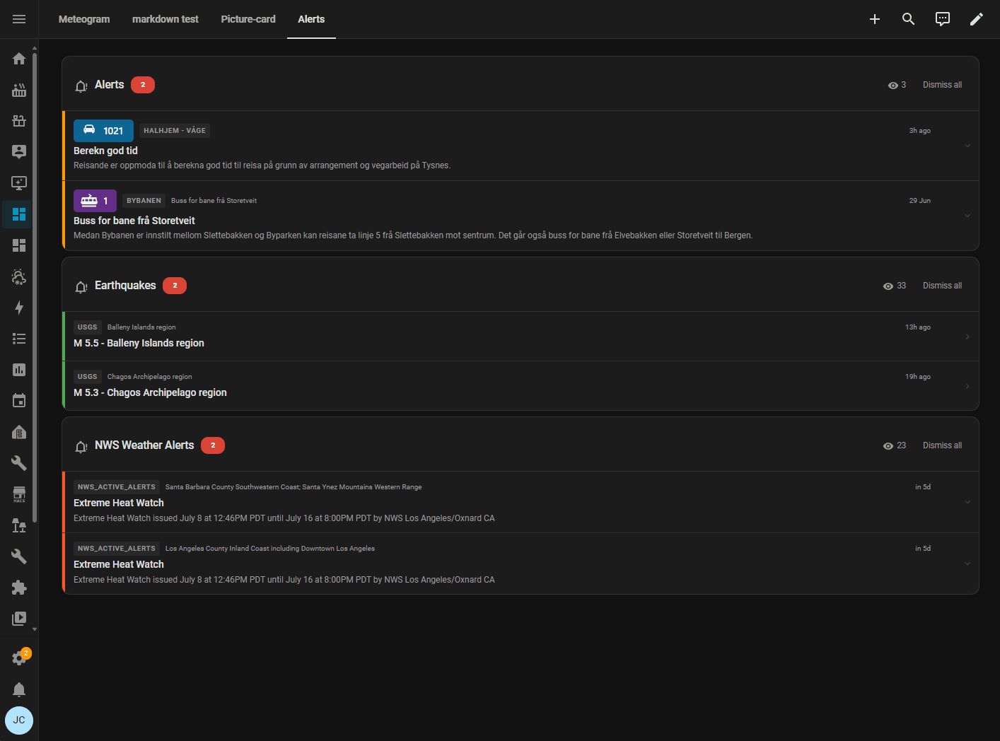
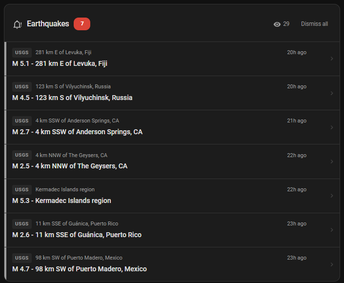
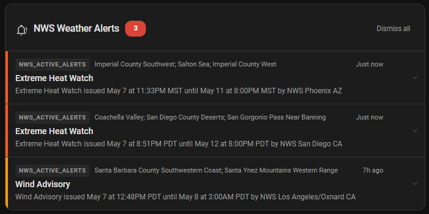
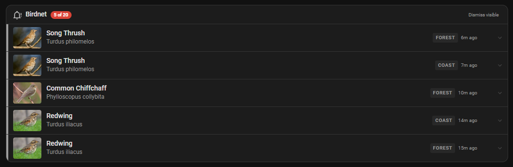

# HA Alert Card

[![hacs][hacs-badge]][hacs-url]
[![Validate with HACS][hacs-validation-badge]][hacs-validation-url]
[![release][release-badge]][release-url]
![Maintenance][maintenance-badge]
![GitHub Downloads (all assets, all releases)][downloads-total]
![GitHub Downloads (all assets, latest release)][downloads-latest]

A Home Assistant Lovelace card that displays alerts from **any entity** with structured alert data in attributes. Uses [CAP (Common Alerting Protocol)](https://docs.oasis-open.org/emergency/cap/v1.2/CAP-v1.2.html) field names as defaults — entities that already follow CAP work with zero field mapping.



## Features

- **Universal** — works with any entity that stores alerts as a list in an attribute
- **CAP defaults** — zero-config for CAP-compliant entities (event, description, severity, etc.)
- **Custom mapping** — override field names for non-CAP entities
- **Multiple sources** — combine alerts from different integrations in one card
- **Dismiss** — per-alert dismiss, stored server-side per HA user (syncs across devices)
- **Expandable** — click to expand per-alert detail using the `formatted_content` field on each alert item; falls back to entity-level attribute
- **Per-alert images** — a badge or icon inline in each alert row, taken from `entity_picture` automatically, or from any attribute you name with `image_attribute` (e.g. Entur TravelTag)
- **Severity coloring** — color bar by severity level, fully configurable
- **Tap action** — click alert to navigate to URL or show more-info
- **Sortable** — by severity (default) or time
- **Safe with untrusted feeds** — feed text is HTML-escaped and link/image URLs are scheme-restricted (see [Security](#security))
- **Lightweight** — single JS file, no build step, no dependencies

## Installation

### HACS (Recommended)

1. Open HACS in your Home Assistant instance
2. Click the three-dot menu (⋮) → **Custom repositories**
3. Add the repository URL: `https://github.com/DTekNO/ha-alert-card`
4. Category: **Dashboard** (Lovelace)
5. Click **Add**, then find "Alert Card" in the store and click **Download**
6. **Restart Home Assistant** (or hard-refresh browser)
7. The resource is auto-registered. If not, add manually:
   - URL: `/hacsfiles/ha-alert-card/ha-alert-card.js`
   - Type: JavaScript Module

### Manual

1. Copy `ha-alert-card.js` to `/config/www/ha-alert-card.js`
2. Add resource in **Settings → Dashboards → Resources**:
   - URL: `/local/ha-alert-card.js`
   - Type: JavaScript Module

## Configuration

### Minimal (CAP-compliant entity)

If your entity stores alerts in an `alerts` attribute with CAP field names, no mapping is needed:

```yaml
type: custom:ha-alert-card
sources:
  - entity: sensor.norway_alerts_vestland
```

This automatically reads from the `alerts` attribute and maps:
| Display | CAP field (default) |
|---------|-------------------|
| Title | `event` |
| Message | `description` |
| Severity | `severity` |
| Time | `starttime` |
| ID | `id` |
| Link | `url` |
| Area | `area` |
| Instruction | `instruction` |

### Multiple sources with custom mapping

```yaml
type: custom:ha-alert-card
title: Alerts & Disruptions
sources:
  # Norway Alerts — CAP-native, zero mapping needed. The per-alert icon comes
  # from entity_picture automatically; no image_attribute needed.
  - entity: sensor.norway_alerts_vestland
    name: Met.no

  # Entur SX — per-line sensor, TravelTag badge shown in each row
  - entity: sensor.skyss_disruption_sky_line_1021
    name: Skyss
    attribute: all_deviations
    image_attribute: travel_tag
    mapping:
      title: summary
      message: description
      severity: status
      time: valid_from
      id: id

  # Any other entity with alerts in an attribute
  - entity: sensor.my_rss_feed
    name: News
    attribute: items
    mapping:
      title: headline
      message: body
      severity: priority
      time: published
      id: guid
      url: link
```

### Full configuration reference

```yaml
type: custom:ha-alert-card
title: Alerts                    # Card header title
max_items: 20                    # Max alerts to display
show_dismiss: true               # Show dismiss buttons
show_source_badge: true          # Show source label per alert
show_area: true                  # Show area/location
show_time: true                  # Show relative time
show_image: true                 # Show per-alert images (entity_picture by default)
compact: false                   # One line per alert: thumbnail, title over message; source, area, time at right
sort_by: severity                # 'severity' or 'time'
dismiss_key: ha-alert-card-dismissed  # localStorage key (change if using multiple cards)
tap_action:
  action: navigate               # Default tap action if no URL in alert
  navigation_path: /lovelace/alerts

# Custom severity → color mapping (extends built-in defaults)
severity_colors:
  extreme: "#db4437"
  severe: "#ff5722"
  moderate: "#ff9800"
  minor: "#fdd835"
  # Add your own values here

sources:
  - entity: sensor.norway_alerts_vestland
    name: Weather                # Display name in source badge
    attribute: alerts            # Attribute containing the list (default: 'alerts')
    image_attribute: travel_tag      # Optional: defaults to entity_picture
    detail_attribute: formatted_content  # Attribute rendered as markdown when alert is expanded
    mapping:                     # Field mapping (all optional if using CAP names)
      title: event
      message: description
      severity: severity
      time: starttime
      id: id
      url: url
      area: area
      instruction: instruction
```

### Source options

| Option | Type | Default | Description |
|--------|------|---------|-------------|
| `entity` | string | required unless `device` is set | Entity ID |
| `device` | string | — | HA device id. Every non-diagnostic entity under the device is read, gathered afresh on each refresh, for integrations that create one entity per alert and remove it when the alert ends ([cap_alerts](https://github.com/seevee/cap_alerts), NINA). `attribute` defaults to `_self`. The id is the last part of the device page URL; the visual editor lists devices by name. |
| `name` | string | entity or device name | Source badge label |
| `attribute` | string | `alerts` | Attribute holding the alerts: a list, or a single alert object. `_self` reads the entity's own attributes as one alert, with states such as `normal`, `0`, `ok`, `idle`, `none`, `unavailable` meaning no alert (`unknown` too, unless the attributes carry an alert). |
| `detail_attribute` | string | `formatted_content` | Attribute rendered as markdown when an alert is expanded. Checked on the per-alert item first (`alert._raw`), then falls back to the entity attribute. |
| `image_attribute` | string | `entity_picture` | Attribute name for an image shown in each alert row (32px high). Checked on the per-alert item first, then falls back to the entity attribute. Defaults to `entity_picture`, so most entities need no configuration — set this only to use a different attribute. To turn images off, use `show_image: false`. |
| `mapping` | object | CAP defaults | Field name mapping (see below) |

### Mapping fields

| Field | CAP default | Description |
|-------|-------------|-------------|
| `title` | `event` | Alert headline |
| `message` | `description` | Alert body text |
| `severity` | `severity` | Severity level for color coding |
| `time` | `starttime`, then `onset`, `effective` | Timestamp (ISO 8601) |
| `id` | `id` | Unique identifier for dismiss tracking |
| `url` | `url`, then `web` | Link for tap action |
| `area` | `area`, then `area_desc` | Geographic area |
| `instruction` | `instruction` | Action instruction (shown when expanded) |

### Built-in severity colors

The card recognizes these severity values out of the box:

| Value | Color | Standard |
|-------|-------|----------|
| `extreme` / `red` / `critical` | Red | CAP / Norway |
| `severe` / `high` | Deep orange | CAP |
| `moderate` / `orange` / `medium` | Orange | CAP / Norway |
| `minor` / `yellow` / `low` | Yellow | CAP / Norway |
| `info` / `planned` | Blue | Generic / Entur |
| `green` | Green | Norway |

Unrecognized values get neutral gray. Add custom colors via `severity_colors`.

## Behavior

- **Tap (with URL)** — if the alert has a `url` field:
  - Internal path (`/lovelace/...`) → navigates within HA
  - External URL (`https://...`) → opens in new tab
- **Tap (no URL)** — expands/collapses the alert to show full description and instruction
- **Dismiss** — click × to hide an alert. Stored **server-side per Home Assistant user**, so dismissals follow you across browsers and devices and survive a cache clear. Existing `localStorage` dismissals are migrated automatically on first load.
- **Show dismissed** — click the eye icon in the header to reveal dismissed alerts with restore buttons
- **Auto-cleanup** — dismissed alerts are automatically pruned from storage when they disappear from the entity (expired, removed by integration)
- **Sort** — by default, highest severity first. Set `sort_by: time` for newest-first.
- **Reorder sources** — drag sources in the visual editor to control grouping

## Examples

### USGS Earthquake Feed

Uses the USGS public GeoJSON feed via HA's built-in REST integration. No account or API key required.



**`configuration.yaml`:**
```yaml
rest:
  - resource: https://earthquake.usgs.gov/earthquakes/feed/v1.0/summary/2.5_day.geojson
    sensor:
      - name: "USGS Earthquakes"
        value_template: "{{ value_json.features | length }}"
        json_attributes:
          - features
```

**Card config:**
```yaml
type: custom:ha-alert-card
title: Earthquakes
sources:
  - entity: sensor.usgs_earthquakes
    name: USGS
    attribute: features
    mapping:
      title: properties.title
      area: properties.place
      severity: properties.alert
      url: properties.url
      id: id
      time: properties.time
grid_options:
  columns: full
  rows: auto
```

Notes:
- `properties.alert` is the USGS PAGER impact level (`green`/`yellow`/`orange`/`red`). Only populated for significant earthquakes — smaller quakes show as grey.
- `properties.time` is a Unix millisecond timestamp — the card handles this correctly and displays relative times ("2h ago", etc.).
- Consider filtering by area if you want to reduce the payload, e.g. `?minmagnitude=4.5` appended to the resource URL.

### US National Weather Service Alerts



```yaml
rest:
  - resource: https://api.weather.gov/alerts/active?area=CA
    headers:
      User-Agent: HomeAssistant
      Accept: application/geo+json
    sensor:
      - name: "NWS Active Alerts"
        value_template: "{{ value_json.features | length }}"
        json_attributes:
          - features
```

Add to `configuration.yaml` (or your REST sensor config file). Replace `CA` with your state code.

```yaml
type: custom:ha-alert-card
title: NWS Weather Alerts
sources:
  - entity: sensor.nws_active_alerts
    attribute: features
    detail_attribute: properties.description
    mapping:
      title: properties.event
      message: properties.headline
      severity: properties.severity
      area: properties.areaDesc
      time: properties.onset
      id: properties.id
      instruction: properties.instruction
grid_options:
  columns: full
  rows: auto
```

Notes:
- The `User-Agent` header is required by the NWS API.
- Filter by state with `?area=CA`, `?area=TX`, etc. Without a filter the full US feed can be very large.
- `properties.severity` values are CAP-standard (`Extreme`/`Severe`/`Moderate`/`Minor`) and map directly to the card's built-in color scheme.
- `detail_attribute: properties.description` shows the full description (with `* bullet` formatting) when an alert is expanded. The `instruction` mapping surfaces safety instructions below the description.

### One entity per alert (cap_alerts)

[cap_alerts](https://github.com/seevee/cap_alerts) creates one sensor per active alert
and groups them under one device per provider. Point a source at the device and the card
follows the entities as they come and go; its CAP attribute names are read without a
mapping.

```yaml
type: custom:ha-alert-card
title: Weather alerts
sources:
  - device: 1a2b3c4d5e6f7a8b9c0d1e2f3a4b5c6d
    name: NWS
```

Notes:
- The device id is the last part of the URL on the device's page under Settings → Devices & services, or pick the device by name in the visual editor.
- One device per provider and scope, so NWS plus ECCC is two sources. An alert seen through two devices is shown once.
- `more-info` on a row opens that alert's own entity.
- cap_alerts publishes a `web` link, so a tap navigates to it instead of expanding. To expand the row and show the description and instruction instead, add `mapping: { url: none }` to the source.

### Compact rows — bird detections from two stations

This example shows the use of compact mode. It can be used if you expect a lot of alerts and think the alert list is too dominating on your dashboard. Two sensors whose `detections` attribute is a list of recent detections, shown as one row
each with `compact: true`. The species photo comes from each detection's `image` field,
and expanding a row shows the sensor's `formatted_content`.



```yaml
type: custom:ha-alert-card
title: Birdnet
compact: true
hide_when_no_alerts: true
max_items: 5
sources:
  - entity: sensor.outside_birdnet_coast_history
    name: Coast
    attribute: detections
    detail_attribute: formatted_content
    image_attribute: image
    mapping:
      title: species
      message: scientific_name
      time: timestamp
      id: detection_id
  - entity: sensor.outside_birdnet_forest_history
    name: Forest
    attribute: detections
    detail_attribute: formatted_content
    image_attribute: image
    mapping:
      title: species
      message: scientific_name
      time: timestamp
      id: detection_id
grid_options:
  columns: full
  rows: auto
```

Notes:
- `message` is the one-line subtitle under the title in compact mode; the full text also appears when a row is expanded.
- `name` becomes the source badge on the right, so two feeds share one card and stay distinguishable.
- `5 of 20` in the header means five rows are shown of twenty undismissed alerts (`max_items: 5`).

## Security

Alerts come from third-party feeds, so the card treats every feed-supplied value as untrusted:

- **Alert text is HTML-escaped** — `title`, `message`, `area`, `instruction`, the source badge and the timestamp are escaped before rendering, so markup in a feed item displays as literal text instead of executing. Ordinary punctuation (ampersands, apostrophes, quotes, dashes, accents) renders exactly as written.
- **The expandable detail is rendered as markdown, not raw HTML** — `detail_attribute` content is handed to Home Assistant's own `ha-markdown` component, which sanitizes it. Feeds that use markdown formatting (such as the NWS bullet lists in the example below) display as intended.
- **Image URLs are scheme-restricted** — `image_attribute` values must be `http(s)`, protocol-relative, site-relative, or `data:image/…`. Anything else renders no image.
- **Link targets are scheme-restricted** — a feed's `url` opens externally only for `http(s)`; other values fall back to a more-info dialog rather than being followed.

Escaping was added in **2026.8.1** as a security measure. If you are running an older version and consume any external feed, please update.

## Compatibility

**Requires Home Assistant 2024.6.0 or newer.** The card hides itself through the
dashboard's card wrapper — the same mechanism a conditional card uses — so that a hidden
card gives up its grid cell in a sections view. That wrapper contract arrived in
2024.6.0 ([frontend #20966](https://github.com/home-assistant/frontend/pull/20966)); on
older releases the card would hide but leave a blank cell behind. HACS enforces the
minimum from `hacs.json`.

Tested with:
- [Norway Alerts](https://github.com/jnxxx/homeassistant-norway_alerts) (CAP-native, zero-config)
- [Entur SX](https://github.com/jnxxx/ha-entur_sx) (with mapping)
- USGS Earthquake GeoJSON feed (via REST sensor, see example above)
- US National Weather Service alerts API (via REST sensor, see example above)

Should work with any integration that stores structured alerts in entity attributes.

## Development

Edit `src/ha-alert-card.js` and hard-refresh the browser — there is no build step and no dependencies.

```bash
# Run the tests (needs only node)
for t in test/*.test.js; do node "$t"; done
```

`RELEASE_NOTES.md` is the body of the next GitHub release: the newest changelog section
followed by a short standing description of the card. Update it with each release; the
recipe is in a comment at the top of the file.

`dist/ha-alert-card.js` is a generated copy of `src/`, committed because HACS resolves a plugin file from the release asset, then `dist/`, then the repo root. It is kept in step automatically: a workflow rebuilds it on pushes that touch `src/`, and the release workflow rebuilds it again at tag time with the version injected from the tag. Never edit `dist/` or the version string by hand.

`mockup.html` is a standalone browser mockup with simulated Home Assistant data, useful for iterating on layout without a running HA instance.

## License

AGPL-3.0

[hacs-badge]: https://img.shields.io/badge/HACS-Custom-orange.svg
[hacs-url]: https://github.com/DTekNO/ha-alert-card
[hacs-validation-badge]: https://github.com/DTekNO/ha-alert-card/actions/workflows/validate-with-hacs.yml/badge.svg
[hacs-validation-url]: https://github.com/DTekNO/ha-alert-card/actions/workflows/validate-with-hacs.yml
[maintenance-badge]: https://img.shields.io/maintenance/yes/2026.svg
[release-badge]: https://img.shields.io/github/release/DTekNO/ha-alert-card.svg
[release-url]: https://github.com/DTekNO/ha-alert-card/releases
[downloads-total]: https://img.shields.io/github/downloads/DTekNO/ha-alert-card/total
[downloads-latest]: https://img.shields.io/github/downloads/DTekNO/ha-alert-card/latest/total
